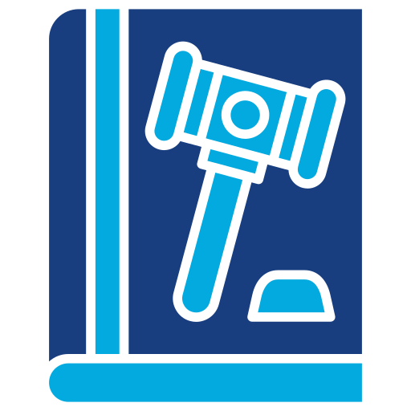

# Code of Conduct

|  | **Defines the standards of behavior expected from system collaborators. It is helpful in maintaining a positive contribution environment.** |
|------------------------------------------------|---------------------------------------------------------------------------------------------------------------------------------------------------------------------------------------------------------------------------|

## Our Commitment
We are committed to providing a welcoming and safe environment for everyone, regardless of experience, gender, gender identity and expression, sexual orientation, personal appearance, body size, race, ethnicity, age, religion, nationality, or other similar characteristics.

## Our Standards
- Be kind and respectful to others.
- Do not use sexualized language or behavior.
- Respect different opinions and points of view.

## Reports of Unacceptable Behavior
To report any behavior that does not comply with this code of conduct, please contact rsainz.cocha@gmail.com

> [!IMPORTANT]
> [Contributions](CONTRIBUTING.md): Get details about our code of conduct and the process for submitting pull requests.
>
> [Changelog](CHANGELOG.md): Record of all important changes to the project.
>
> [Dependencies](DEPENDENCIES.md): List and description of project dependencies.
