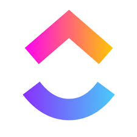
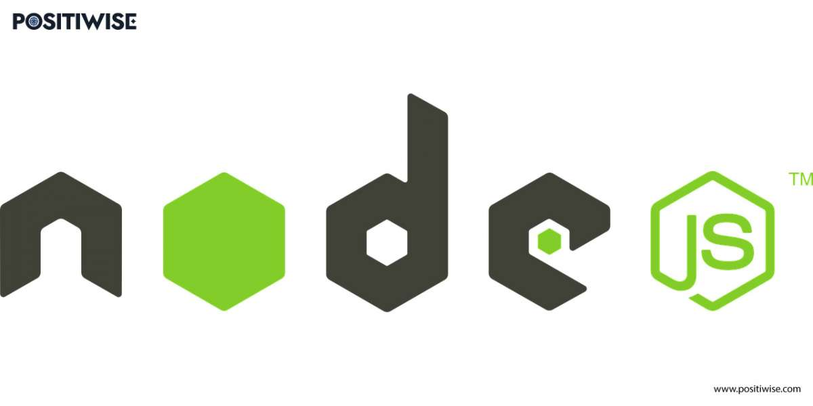

# Call Center

|  | **New comprehensive complaints/complaints system for citizen service, improving efficiency and transparency in municipal management and promoting a more connected and participatory city.** |
|------------------------------------------------|---------------------------------------------------------------------------------------------------------------------------------------------------------------------------------------------------------------------------|

## Handled Tools
- **IDE**: Visual Studio Code

    

- **Design UI/UX**: Figma

    

- **Project management**: ClickUp

    

## Technologies Used
- **Frontend**: Angular
    
    

- **Backend**: Nestjs & Node.js

     

- **Database**: PostgreSQL

    

## Installation
...

## Use
Access the user interface in your browser and follow the instructions to register or follow up a claim.
...

> [!IMPORTANT]
> [Documentation](docs/README.md): Detailed system folder. It may include user guides, developer manuals, diagrams, etc.
